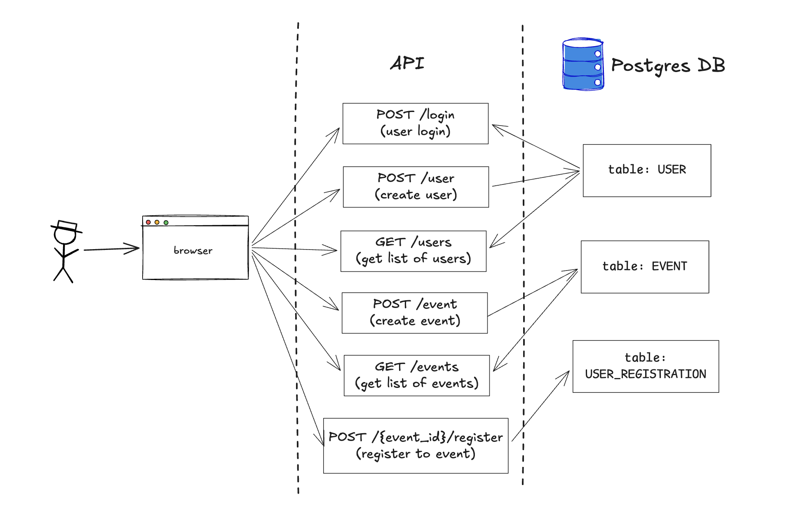

# Demo Membership API

## Summary

A demo API with basic membership and event management endpoints for an organisation.

While this demo app only covers the backend API, since this is built with FastAPI,
you can play around with the endpoints through a web-based interface containing the API documentation.

The focus of this POC is the core functionality of members management, with the following flow:
- Create a user (initially an admin "superuser")
- Login in as a user
- Add an event
- Check list of events
- Register to an event

This API covers the following core use cases:
1. User login - upon application startup, the database 
2. Add user
2. Get list of users
3. Add event
4. Get list of events
5. Register for event

The following diagram illustrates a high-level overview of what the app does:


### Data persistence

All data is stored in a PostgreSQL database that runs alongside the app
    - TODO: use docker compose to automatically run and init the DB before the app

On startup, the DB is initialised with the following tables based on the FastAPI SQL models:
1. `user` - contains records of users (primary key is `id` which is UUID)
2. `event` - contains records of events (primary key is `id` which is UUID)
3. `user_registration` - contains mappings of user and event via foreign keys to `user.id` and `event.id` 


## Project setup

### Pre-requisites

The DB and the app both run in docker containers, orchestrated by docker compose (see `docker-compose.yaml` file).
To run the app, you must have Docker and docker compose - refer to the [online docker reference](https://docs.docker.com/compose/install/) to install docker in your machine

### Running the app

1. Create a `.env` file with the required environment vars

```
cp ./.env.example ./.env
```

2. In your `.env` file, replace the values for each variable:

POSTGRES_USER=arbitrary_username
POSTGRES_PASSWORD=arbitrary_password
FIRST_SUPERUSER_EMAIL=arbitrary_email
FIRST_SUPERUSER_PASSWORD=arbitrary_password
API_SECRET_KEY=arbitrary_str


3. Run docker-compose

The following command will automatically build the image through Dockerfile and set up the DB connection:

```
docker compose up
```

Wait for a few seconds (~5 seconds) until the DB and the app are ready to start accepting connections.

4. Open a browser and type `localhost:8000/docs` in the search bar

This will take you to the Swagger API documentation, which allows you to test the API using the credentials that
you used in your `.env` file.

---

### What would I build in the next 4 hours


1. More endpoints like
    - Update user - allow members to update their data
    - See registrations - allow members to see their event registrations, and allow admins to see
        users who have registered to an event
    - Subscription management - allow users to check their subscription status and payments, renew subscriptions
    - Signup and reminder emails - send emails when a user joins or to remind them about their subscriptions

2. Add tests - I did not add them here initially since testing via the API docs was enough. But ideally have unit tests.

3. DevOps stuff like:
    - Pre-commit hooks
    - Git workflows and Cloud deployment - use GH Actions for automated testing and build, as well as deploy to Cloud

4. Build the frontend - using React.js (lots of online learning and support references for integrating React with FastAPI)

5. Cloud infra setup - Use terraform to build cloud infra needed, depending on the cloud provider


---

### Part 2: One Problem, Your Solution

> The client mentions, almost as an aside, that they currently send every member a manual renewal reminder email three weeks before their subscription expires. One person spends about four hours a week on this. They didn't include it in the brief because they assumed it was too small to fix. Describe how you would automate this. Be specific, what would you build or configure, using which tools, and why. If it touches your POC, show that connection. If it's a separate automation layer, describe it clearly enough that someone could build it from your description.

#### What I would do:
Since the database stores information about a user/member, we can also store the status of a member's subscription in this DB. This will allow us to automate sending of emails based on the subscription status in the DB.
Rough steps:
1. Add a data model for subscriptions
    - In `models.py`, add a `Subscription` SQLModel to represent a table with subscription start date and end date of a user
    - Add any additional properties like subscription price, notes, etc.
2. Add an endpoint to create a subscription record when a user becomes a member or when a member pays for subscription.
3. Add a script that runs on a regular schedule to check users whose subscription is ending soon
    - The script can query this subscription table for active users' subscription end date. If the end date is coming soon (e.g. in 1 month), then trigger the following function.
4. Create a function (or another endpoint perhaps?) to send an email to each user whose subscription is ending soon, to remind them of renewal.

---

### Part 3: Data Security

> This system will store personal data for 800 members including names, email addresses, and payment history. What are the three most important security considerations you would build in from the start, and for each one, what specifically would you do?

Important considerations:
1. Encryption and masking
    - Encyrption of database columns where personal data is stored.
    - Encyrption in transit using TLS to ensure that data that is being transmitted cannot be intercepted.
    - Mask confidential data like passwords and credit card numbers - use hashing tools to verify passwords and other sensitive information
    - Use masing tools (like hashlib or pwdlib in Python) to mask data from application logs and communications with third parties.
2. Access control
    - Build minimum user privileges to access certain user data. For example, a user can only see their own data and not others', only admins can see users' data (excluding sensitive data like passwords)
    - Password-protect the API key and database password. Use secure tools like Vault when deploying to production to access secrets securely.
3. Data retention
    - Only store these data when needed and only up to when they are needed for the functionality of the app to the user
    - Have a process to remove user data upon user request or when data has reached a staleness threshold
